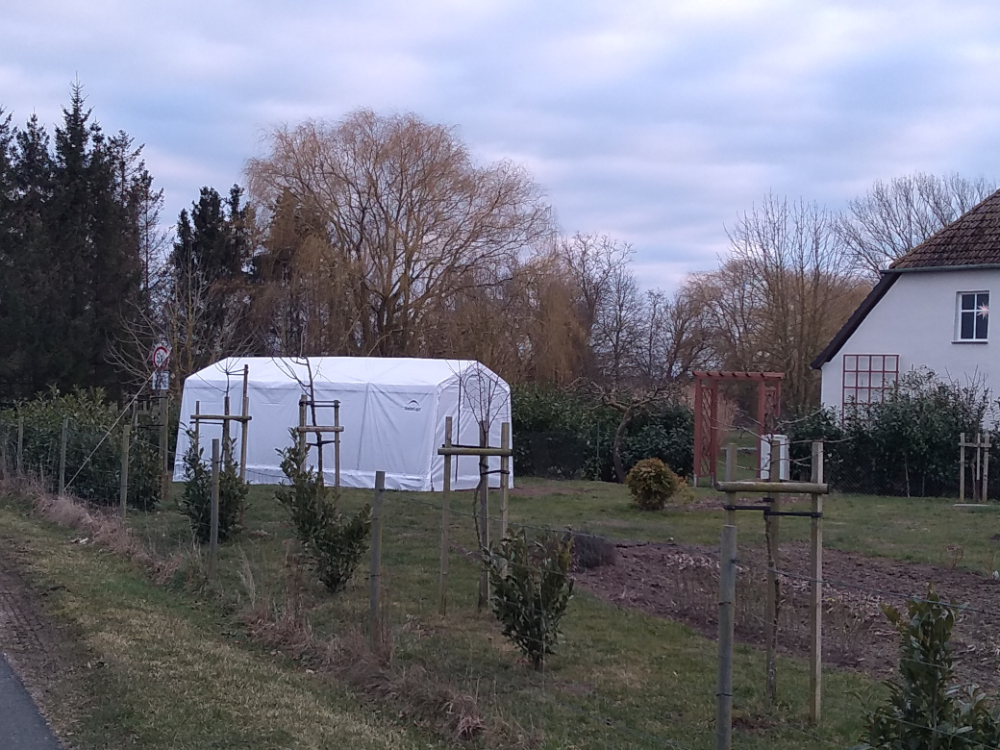

---
title: Bildergalerie
---  
# Hier ein paar Bilder

<input type="button" value="zurück" onClick="if (i>0) { LoadPic(--i) };">
<input type="button" value="vor" onClick="if (i<pictures.length-1) { LoadPic(++i) };">

